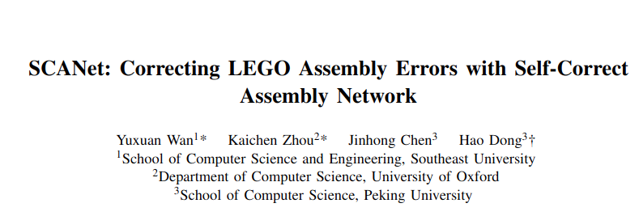
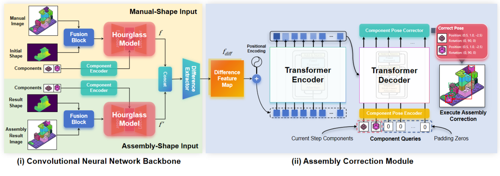
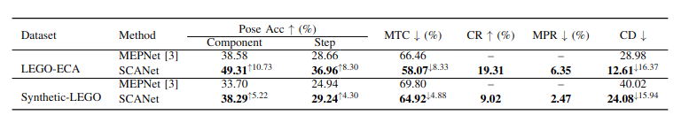
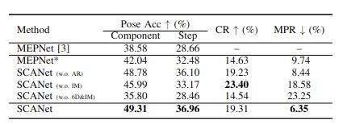

# SCANet: Correcting LEGO Assembly Errors with Self-Correct Assembly Network (IROS24 Oral Presentation, Best Application Paper Finalist!!😊)


This is the official implement repository for the SCANet: Correcting LEGO Assembly Errors with Self-Correct Assembly Network (IROS 2024).

[[Project Website](https://scanet-iros2024.github.io/)]

[[Paper](https://arxiv.org/abs/2403.18195)]











# Dataset

You can download the dataset from [[Dataset BaiduNetDisk](https://pan.baidu.com/s/1olngW0dnYMggK9RkohBZ-w?pwd=ard7)], 
[[Dataset Google Driver](https://drive.google.com/file/d/1gbLhaOiUsnfuYrKHe5TAd3IlUteya267/view?usp=drive_link)] 


# Environment
## Setting 1 (Recommended)
To set up the environment, follow these steps:
0. Install Conda.
1. Download the compressed package: [SCANet Environment](https://drive.google.com/file/d/1XQptIuDqBNVSZcVshG1X_ZzR2rHArmoN/view?usp=drive_link).
2. Create a folder named `SCANet_env`:
```shell
mkdir -p /home/username/.conda/env/SCANet_env # replace username with your actual username
```
3. Extract the compressed package into the `SCANet_env` folder:
```shell
tar -xzf SCANet_env.tar.gz -C /home/username/.conda/env/SCANet_env # replace username with your actual username
```
4. Activate the environment:
```shell
conda activate SCANet_env
```
## Setting2
To install the required packages, use the following command:
```shell
pip install -r requirements.txt
```

# Training
Download the pre-trained model (DETR + Hourglass) from: [[Pre-trained Model](https://drive.google.com/file/d/1HMPtxH1gLG4ON8t7RIyTpLAb-SpwqSkm/view?usp=sharing)].

Please put the pre-trained model in the `weights/` folder under the `SCANet_env` folder.

To train SCANet, run the following script:
```shell
bash script/train_SCANet.sh
```

# Evaluation
To evaluate SCANet, run the following script:

```shell
bash script/eval_SCANet.sh
```


# BibTex
```text
@article{wan2024SCANet
      author    = {Yuxuan Wan, Kaichen Zhou, Jinhong Chen ,Hao Dong},
      title     = {SCANet: Correcting LEGO Assembly Errors with Self-Correct Assembly Network},
      journal   = {IROS},
      year      = {2024},
}
```

# TODO:
- [ ] 完善注释
- [x] 添加环境配置
- [x] 添加training and testing 使用方法
